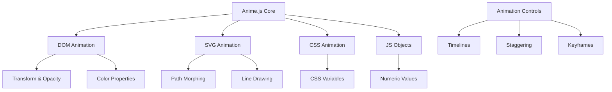

# 🚀 Anime.js Animation Framework


<div align="center">
  

  <p><strong>A lightweight JavaScript animation library</strong></p>
  <p>Modern, flexible, and high-performance animations for web projects</p>
</div>

---

## 📋 Table of Contents

- [Overview](#-overview)
- [Features](#-features)
- [Implementation Guide](#-implementation-guide)
- [Installation](#-installation)
- [Performance Optimization](#-performance-optimization)
- [Framework Integration](#-framework-integration)
- [Browser Compatibility](#-browser-compatibility)
- [Examples](#-examples)
- [Comparison with Other Libraries](#-comparison-with-other-libraries)
- [Future Improvements](#-future-improvements)
- [Resources](#-resources)
- [Author](#-author)

---

## 🌟 Overview

Anime.js is a versatile JavaScript animation library that powers smooth, flexible animations across modern web projects. Version 4.0.2 brings enhanced performance, responsive features, and improved developer experience for animations that shine on any device or platform.

### 🛠️ Tech Stack



### 🎯 Performance Target Matrix

| Performance Level | Device Target | Animation Complexity | Optimization Priority |
|-------------------|---------------|----------------------|-----------------------|
| 🟢 HIGH | High-end devices | Complex animations, rich visual effects | Standard optimization |
| 🟡 MEDIUM | Average devices | Balanced animations, some visual enhancements | Enhanced optimization |
| 🔴 LOW | Low-end devices | Minimal animations, core functionality only | Maximum optimization |

---

## ✨ Features

### Core Capabilities

- **🎨 Versatile Targets**: 
  - DOM elements
  - CSS properties 
  - SVG attributes
  - JavaScript objects

- **⚙️ Animation Controls**:
  - Timelines for sequencing
  - Staggering for multiple elements
  - Keyframe animations
  - Playback control (play, pause, reverse)

- **📱 Responsive Design**:
  - Media query support via Scope API
  - Relative value units
  - Device-adaptive animations

- **🔧 Animation Types**:
  - Property animations
  - SVG path morphing
  - Line drawing
  - Color transitions
  - 3D transforms

### Feature Decision Matrix

| Context Parameter | Feature Selection | Implementation Approach |
|-------------------|------------------|-------------------------|
| 🔴 LOW + SHARED_HOSTING | Base animate() only | Minimize animations, use only transform/opacity |
| 🟡 MEDIUM + SHARED_HOSTING | animate() + stagger() | Limited sequences, optimize for performance |
| 🟢 HIGH + ANY_HOSTING | Full feature set | Leverage all capabilities as needed |
| ANY + SERVER-RENDERED | DOM-ready events | Ensure animations execute after DOM loads |
| ANY + MODERN-FRAMEWORK | Component lifecycle hooks | Initialize animations in mount/effect hooks |

---

## 📝 Implementation Guide

### Installation Decision Tree

```
START
├── Is the project using a build system with NPM/Yarn?
│   ├── YES
│   │   └── INSTALL METHOD: npm i animejs
│   └── NO
│       ├── Is the project on a shared hosting environment?
│       │   ├── YES
│       │   │   └── INSTALL METHOD: CDN with version lock
│       │   │       └── <script src="https://cdn.jsdelivr.net/npm/animejs@4.0.2/lib/anime.min.js"></script>
│       │   └── NO
│       │       └── INSTALL METHOD: Download and self-host
│       │           └── Download from https://github.com/juliangarnier/anime/releases
└── END
```

### Implementation Process

Follow this systematic approach for implementing Anime.js in your project:

1. **🔍 Analyze Requirements**
   - Determine performance targets
   - Identify platform context
   - Assess animation complexity
   - Evaluate hosting environment

2. **📋 Select Integration Approach**
   - Choose import strategy based on needs
   - Apply framework-specific patterns
   - Implement device adaptations

3. **🎬 Develop Animations**
   - Start with core patterns
   - Add intermediate complexity as needed
   - Implement advanced patterns last
   - Test across devices and browsers

---

## 📦 Installation

### NPM/Yarn (Recommended)

```bash
# NPM
npm install animejs

# Yarn
yarn add animejs
```

### CDN

```html
<!-- Latest version -->
<script src="https://cdn.jsdelivr.net/npm/animejs@4.0.2/lib/anime.min.js"></script>
```

### Self-Hosted

Download the latest release from [GitHub](https://github.com/juliangarnier/anime/releases) and include it in your project:

```html
<script src="path/to/anime.min.js"></script>
```

### Module Import (ES6)

```javascript
// Import the entire library
import anime from 'animejs';

// Import specific functions (recommended for tree-shaking)
import { animate, stagger, createTimeline } from 'animejs';
```

---

## ⚡ Performance Optimization

### Optimization Algorithm

```javascript
function determineOptimizationStrategy(context) {
  // Initialize optimization array
  const optimizations = [];
  
  // Step 1: Always use hardware-accelerated properties
  optimizations.push({
    type: "HARDWARE_ACCELERATION",
    implementation: "Use transform and opacity properties exclusively when possible"
  });
  
  // Step 2: Analyze device target and adjust accordingly
  if (context.performanceTarget === "LOW") {
    optimizations.push({
      type: "USE_WAAPI",
      implementation: "Implement Web Animations API version for simple animations"
    });
    
    optimizations.push({
      type: "REDUCE_ANIMATIONS",
      implementation: "Limit number and complexity of animations"
    });
  }
  
  // Step 3: Apply framework-specific optimizations
  if (context.platformContext === "MODERN-FRAMEWORK") {
    optimizations.push({
      type: "TREESHAKING",
      implementation: "Import only required functions"
    });
    
    optimizations.push({
      type: "CLEANUP",
      implementation: "Ensure animations are properly cleaned up on component unmount"
    });
  }
  
  return optimizations;
}
```

### Performance Best Practices

- ✅ **Animate transform and opacity** whenever possible
- ✅ Use **will-change** for frequently animated elements
- ✅ Implement **staggering** for multiple elements
- ✅ Optimize SVG paths before animation
- ✅ Reduce animations on low-end devices
- ✅ Respect user preference for reduced motion
- ❌ Avoid animating properties that trigger layout recalculations
- ❌ Don't animate too many elements simultaneously

---

## 🔄 Framework Integration

### React Implementation Template

```javascript
// Step 1: Import required functions from anime.js
import { animate, stagger } from 'animejs';
import { useEffect, useRef } from 'react';

// Step 2: Create component with animation logic
function AnimatedComponent() {
  // Step 2.1: Create reference to DOM element
  const elementRef = useRef(null);
  
  // Step 2.2: Initialize animation in useEffect hook
  useEffect(() => {
    // Step 2.3: Only run animation if element exists
    if (elementRef.current) {
      // Step 2.4: Create animation with configuration
      animate(elementRef.current, {
        translateX: 250,
        rotate: 360,
        duration: 1000,
        easing: 'easeInOutQuad'
      });
    }
    
    // Step 2.5: Optional cleanup for animations that need to be stopped
    return () => {
      // Animation cleanup if needed
    };
  }, []); // Empty dependency array means run once on mount
  
  // Step 3: Return component JSX with ref attached
  return <div ref={elementRef} className="element"></div>;
}
```

### Vue Implementation Template

```javascript
<template>
  <!-- Step 1: Create element with ref attribute -->
  <div ref="element" class="element"></div>
</template>

<script>
// Step 2: Import animate function
import { animate } from 'animejs';

export default {
  // Step 3: Initialize animation in lifecycle hook
  mounted() {
    // Step 3.1: Access element via refs and animate
    animate(this.$refs.element, {
      translateX: 250,
      rotate: 360,
      duration: 1000,
      easing: 'easeInOutQuad'
    });
  },
  // Step 4: Optional cleanup in beforeUnmount
  beforeUnmount() {
    // Animation cleanup if needed
  }
}
</script>
```

### Server-Rendered Implementation Template

```php
<!-- Step 1: Create target element with unique ID -->
<div id="anime-element-<?php echo $uniqueId; ?>" class="element"></div>

<!-- Step 2: Add script after element definition -->
<script>
  // Step 2.1: Wait for DOM to be ready
  document.addEventListener('DOMContentLoaded', () => {
    // Step 2.2: Import anime.js is already handled via <script> tag
    
    // Step 2.3: Select element and animate
    anime({
      targets: '#anime-element-<?php echo $uniqueId; ?>',
      translateX: 250,
      rotate: 360,
      duration: 1000,
      easing: 'easeInOutQuad'
    });
  });
</script>
```

---

## 🌐 Browser Compatibility

Anime.js works reliably across all modern browsers. Here's a compatibility breakdown:

| Browser | Minimum Version | Support Level | Notes |
|---------|----------------|---------------|-------|
| Chrome | 55+ | ✅ Full | Excellent performance |
| Firefox | 52+ | ✅ Full | Excellent performance |
| Safari | 11+ | ✅ Full | Occasional SVG differences |
| Edge | 15+ | ✅ Full | Excellent performance |
| IE11 | - | ❌ Not supported | Use polyfills or CSS fallbacks |

---

## 🎮 Examples

### Basic Property Animation

```javascript
// Simple translation and rotation
animate('.element', {
  translateX: 250,
  rotate: 360,
  duration: 1000,
  easing: 'easeOutQuad'
});
```

### Staggered Animation

```javascript
// Animate multiple elements with staggered timing
animate('.item', {
  translateY: [50, 0],
  opacity: [0, 1],
  duration: 800,
  delay: stagger(100, {from: 'center'})
});
```

### Timeline Sequence

```javascript
// Create a timeline for sequenced animations
const timeline = createTimeline();

timeline
  .add('.first', {
    translateX: 250,
    duration: 1000
  })
  .add('.second', {
    translateY: 50,
    duration: 800
  }, '-=400') // Start 400ms before previous animation ends
  .add('.third', {
    rotate: 360,
    duration: 1200
  });
```

### SVG Path Animation

```javascript
// Animate SVG path drawing
const drawable = createDrawable('.svg-path');

animate(drawable, {
  draw: [0, 1], // From 0% to 100% of path
  duration: 2000,
  easing: 'easeInOutSine'
});
```

### Scroll-Triggered Animation

```javascript
// Animation triggered by scroll position
const observer = new IntersectionObserver((entries) => {
  entries.forEach(entry => {
    if (entry.isIntersecting) {
      animate(entry.target, {
        translateY: [50, 0],
        opacity: [0, 1],
        duration: 800
      });
      
      // Only animate once
      observer.unobserve(entry.target);
    }
  });
}, { threshold: 0.1 });

// Observe elements
document.querySelectorAll('.scroll-animate').forEach(el => {
  observer.observe(el);
});
```

---

## 📊 Comparison with Other Libraries

| Feature | Anime.js | GSAP | Framer Motion | Motion One | Three.js |
|---------|----------|------|---------------|------------|----------|
| **File Size** | 🟢 Small (~10-15KB) | 🟡 Larger (~23-60KB) | 🟡 Medium (~20KB) | 🟢 Tiny (~2-18KB) | 🔴 Large (150KB+) |
| **Performance** | 🟢 High | 🟢 Very High | 🟢 High | 🟢 Very High | 🟡 Depends on scene |
| **Learning Curve** | 🟢 Gentle | 🟡 Moderate | 🟡 Moderate | 🟢 Gentle | 🔴 Steep (3D) |
| **Framework Agnostic** | 🟢 Yes | 🟢 Yes | 🔴 React-focused | 🟢 Yes | 🟢 Yes |
| **Timeline Support** | 🟢 Yes | 🟢 Advanced | 🟡 Limited | 🟢 Yes | 🔴 No (needs addon) |
| **3D Support** | 🟡 Limited (CSS 3D) | 🟡 Limited (CSS 3D) | 🟡 Limited (CSS 3D) | 🟡 Limited (CSS 3D) | 🟢 Advanced (WebGL) |
| **SVG Animation** | 🟢 Strong | 🟢 Very Strong | 🟢 Strong | 🟡 Basic | 🟡 Via workarounds |
| **Scroll Animations** | 🟢 Built-in (v4) | 🟢 Advanced (plugin) | 🟡 Basic | 🟢 Native API | 🔴 Requires custom |
| **Physics** | 🟡 Basic | 🟢 Advanced | 🟢 Advanced | 🟢 Springs | 🟡 Via addons |
| **Browser Support** | 🟢 Modern | 🟢 Excellent | 🟢 Modern | 🟡 Modern only | 🟡 WebGL support |

### Library Selection Algorithm

```
IF animation_complexity == HIGH AND elements_count > 3000 THEN
  recommended_library = "GSAP"
ELSE IF bundle_size_critical == TRUE AND animation_complexity <= MEDIUM THEN
  recommended_library = "anime.js"
ELSE IF modern_framework_integration == PRIMARY_CONCERN THEN
  IF framework == "React" THEN
    recommended_library = "framer-motion OR anime.js" 
  ELSE
    recommended_library = "anime.js"
ELSE
  recommended_library = "anime.js"
END IF
```

---

## 🚧 Future Improvements

- [ ] Enhance documentation with more device-specific optimizations
- [ ] Develop additional framework-specific integration templates
- [ ] Create specific performance test suites for different devices
- [ ] Implement extended scroll animation capabilities
- [ ] Add more interactive examples with code samples
- [ ] Create pre-built animation patterns library
- [ ] Develop visual timeline tools for animation development
- [ ] Improve SVG optimization techniques for better performance
- [ ] Add TypeScript support and type definitions
- [ ] Implement AI-driven animation suggestions

---

## 📚 Resources

- [Official Documentation](https://animejs.com/documentation/)
- [GitHub Repository](https://github.com/juliangarnier/anime/)
- [Animation Examples](https://animejs.com/documentation/#examples)
- [Browser Support](https://caniuse.com/?search=web%20animations)
- [Performance Optimization Guide](https://github.com/juliangarnier/anime/wiki/)
- [Community Discord](https://discord.gg/animejs)

---

## 👨‍💻 Author

<div align="center">
  
  ### Created with ❤️ by Anik Sarker Akash
  
  [](https://github.com/aniksarker)
  [](https://linkedin.com/in/aniksarker)
  [](https://twitter.com/aniksarker)
  
</div>

---

## 📄 License

This project is licensed under the MIT License - see the [LICENSE](LICENSE) file for details.
